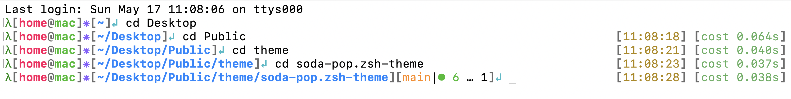
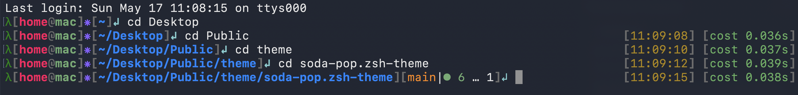

# soda-pop-zsh-theme

## Overview

A fast, customizable, highly visual, and pure-shell asynchronous Git prompt theme for Oh My Zsh.
Created and maintained by Adnan.

It combines an informative git status, an execution tracker, and a rich bubblegum/soda-pop aesthetic with precise color mapping optimized for both light and dark modes.

## Examples




## Features

You can see the following at once in a beautifully formatted one-row layout:

- Current user and host
- Working directory
- Rich and fast asynchronous Git status
- Right prompt execution tracker (Command execution time, cost, and success/error status)

## Git Status Symbols

The git status is updated immediately after a command is finished or when the prompt is drawn.

| Symbol | Meaning |
| ------ | ------- |
| `[branch_name\|✔]` | The repository is clean. |
| `[branch_name\|●n]` | There are n staged files. |
| `[branch_name\|✚n]` | There are n changed but unstaged files. |
| `[branch_name\|…n]` | There are n untracked files. |
| `[branch_name\|✖n]` | There are n unmerged (conflicting) files. |
| `[branch_name\|↓m↑n]` | The local branch is m commits behind and n commits ahead of the remote. |

## Prompt Structure

The structure of the left prompt is as follows:
`λ[user@host]⁕[directory][git_status]↲ `

The structure of the right prompt is as follows:
`[HH:MM:SS] [cost X.XXXs]`

## Installation

### Dependencies

- **Git** with `--porcelain=v2` support (available since 2.11.0).
- **awk**, which is preinstalled on almost any \*nix system.
- **bc** to calculate the command running time cost (pre-installed on macOS, but may require `sudo apt install bc` on Linux).
- **zsh** (version 5.0.0 or newer recommended for `zsh/datetime` support).

### Setup

1. Clone this repository into your Oh My Zsh custom themes directory:

```bash
git clone https://github.com/YOUR_USERNAME/soda-pop.zsh-theme.git $ZSH_CUSTOM/themes/soda-pop.zsh-theme
```

2. Link the theme file to the main custom themes folder:

```bash
ln -s $ZSH_CUSTOM/themes/soda-pop.zsh-theme/soda-pop.zsh-theme $ZSH_CUSTOM/themes/soda-pop.zsh-theme
```

3. Open your `~/.zshrc` and set the theme:

```bash
ZSH_THEME="soda-pop"
```

4. Reload your terminal or run:

```bash
source ~/.zshrc
```

5. **(Optional)** If you use Python `venv`, disable the default prompt modifications to prevent duplicate environment names:

```bash
echo "export VIRTUAL_ENV_DISABLE_PROMPT=1" >> ~/.zshrc
```

Or if you use **Anaconda**:

```bash
conda config --set changeps1 False
```

## Extra Preferences

### Recommended Fonts
To ensure all the Git status symbols (✔, ●, ✖, ↲, ⁕) render perfectly, it is highly recommended to use a modern developer font.
- [JetBrains Mono](https://www.jetbrains.com/lp/mono/)
- Or any [Nerd Font](https://www.nerdfonts.com/)

### Recommended Zsh Plugins
This theme pairs well with the following popular plugins:
- [zsh-autosuggestions](https://github.com/zsh-users/zsh-autosuggestions)
- [zsh-syntax-highlighting](https://github.com/zsh-users/zsh-syntax-highlighting)

## Customization

The appearance of the prompt can be adjusted by modifying the variables in the `soda-pop.zsh-theme` file.

### Color Variables

- `USER_COLOR`: Vibrant Magenta/Pink (`%F{197}`)
- `HOST_COLOR`: Standard Green (`%F{2}`)
- `DIR_COLOR`: Mid-tone Cerulean Blue (`%F{33}`)
- `GIT_INFO_COLOR`: Cyan (`%F{208}`)
- `BRACKET_COLOR`: Medium Gray (`%B%F{242}`)
- `ASTERISK_COLOR`: Deep Coral Orange (`%F{99}`)
- `TIME_COLOR`: Darker Gold/Yellow (`%F{136}`)
- `COST_COLOR`: Mild Sage Green (`%F{71}`)
- `CMD_STATUS_COLOR`: Clear Error Red (`%F{196}`)
- `RETURN_ARROW_COLOR`: Slate Purple/Blue (`%F{6}`)
- `LAMBDA_COLOR`: Forest/Emerald Green (`%F{28}`)

## Troubleshooting

### Shell Slowdown in Huge Git Repositories

- The Git prompt is asynchronous by default, so it shouldn't slow down the shell. However, untracked file detection might still take time. See `man git-status`, Section `--untracked-files` for ways to speed things up if necessary.

# CREDITS

This theme incorporates logic and structures from the following open-source projects. In accordance with their MIT Licenses, their copyright notices are preserved below.

## git-prompt.zsh
**Author**: Wolfgang Popp
**License**: MIT
**Copyright © 2024 Wolfgang Popp**
The asynchronous git status rendering (found in `git-prompt.zsh`) is heavily based on `git-prompt.zsh` by Wolfgang Popp.
**Repository**: [https://github.com/woefe/git-prompt.zsh.git](https://github.com/woefe/git-prompt.zsh.git)

## simplerich-zsh-theme
**Authors**: ChesterYue, Ryota Sasaki
**License**: MIT
**Copyright (c) 2020 ChesterYue, Ryota Sasaki**
The layout inspiration, execution tracker concept, and virtual environment detection logic were heavily inspired by `simplerich-zsh-theme`.
**Repository**: [https://github.com/philip82148/simplerich-zsh-theme.git](https://github.com/philip82148/simplerich-zsh-theme.git)

## zsh-git-prompt
**Author**: Olivier Verdier
**License**: MIT
**Copyright (c) 2014 Olivier Verdier**
The core visual semantics and layout of the git status prompt (✔, ●, ✖, ✚, …) originated from `zsh-git-prompt` by Olivier Verdier.
**Repository**: [https://github.com/olivierverdier/zsh-git-prompt.git](https://github.com/olivierverdier/zsh-git-prompt.git)
